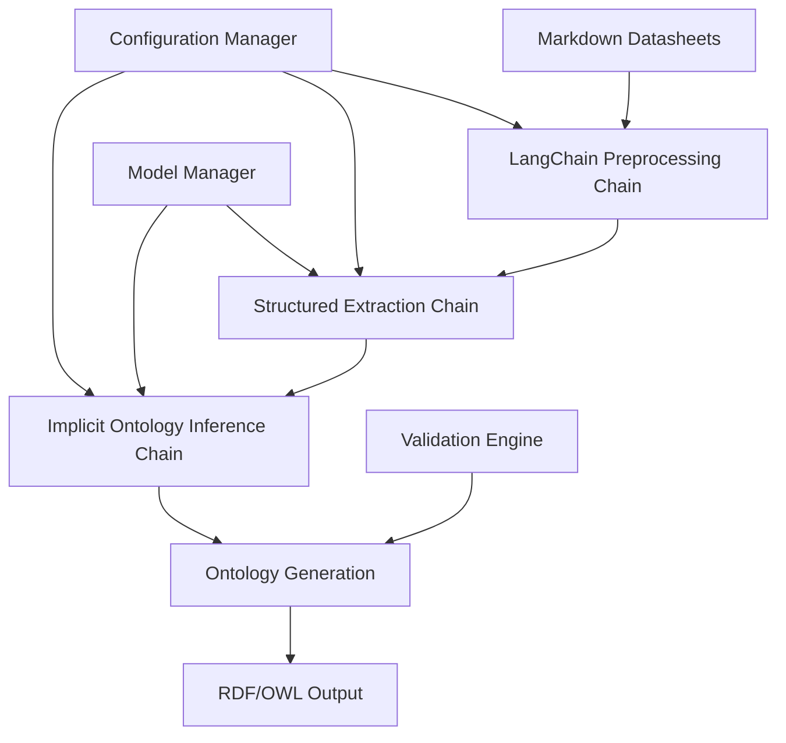

# Design Document

## Overview

The enhanced ontology extraction pipeline leverages LangChain framework to create a robust, maintainable system for extracting both explicit and implicit ontological knowledge from electrotechnical datasheets. The design builds upon the existing OpenAI-based extraction system, replacing direct API calls with LangChain's structured approach while maintaining compatibility with the current RDF ontology generation workflow.

The system will process markdown datasheets through a multi-stage pipeline: preprocessing, structured extraction using Pydantic models, implicit relationship inference, and ontology generation. This approach enables capture of not just explicit component specifications, but also implicit domain knowledge, taxonomic relationships, and semantic constraints that can be inferred from technical documentation.

## Architecture

### High-Level Architecture



### Component Architecture

The system follows a modular architecture with clear separation of concerns:

1. **Chain Manager**: Orchestrates the execution of LangChain chains
2. **Model Manager**: Handles OpenAI model selection and configuration
3. **Extraction Engine**: Manages structured data extraction using Pydantic models
4. **Implicit Inference Engine**: Identifies and extracts implicit relationships
5. **Ontology Generator**: Converts structured data to RDF/OWL format
6. **Configuration Manager**: Handles system configuration and prompt templates

## Components and Interfaces

### LangChain Integration Layer

**Purpose**: Replace direct OpenAI API calls with LangChain framework
**Key Classes**:
- `LangChainExtractor`: Main extraction orchestrator
- `PromptTemplateManager`: Manages component-specific prompts
- `StructuredOutputChain`: Handles Pydantic model-based extraction

**Interface**:
```python
class LangChainExtractor:
    def __init__(self, model_name: str, temperature: float = 0.1)
    def extract_component_data(self, markdown_content: str) -> ComponentModel
    def extract_implicit_relationships(self, component_data: ComponentModel) -> ImplicitOntology
```

### Pydantic Data Models

**Purpose**: Provide type-safe, validated data structures for extraction
**Key Models**:
- `ComponentModel`: Enhanced version of existing component structure
- `PropertyValue`: Technical property with validation
- `ImplicitRelationship`: Inferred semantic relationships
- `ImplicitOntology`: Container for implicit knowledge

**Enhanced ComponentModel**:
```python
class ComponentModel(BaseModel):
    component_type: str = Field(..., description="Component classification")
    model_number: str = Field(..., description="Specific model identifier")
    manufacturer: str = Field(..., description="Manufacturing company")
    properties: List[PropertyValue] = Field(..., description="Technical properties")
    features: List[str] = Field(..., description="Key features")
    implicit_relationships: Optional[List[ImplicitRelationship]] = Field(default=None)
    confidence_scores: Optional[Dict[str, float]] = Field(default=None)
```

### Chain Composition System

**Purpose**: Break down complex extraction into manageable, reusable chains
**Key Chains**:
- `PreprocessingChain`: Text normalization and preparation
- `ExtractionChain`: Structured component data extraction
- `ImplicitInferenceChain`: Relationship and hierarchy inference
- `ValidationChain`: Data quality and consistency checking

**Chain Interface**:
```python
class BaseExtractionChain:
    def __init__(self, llm: ChatOpenAI, prompt_template: PromptTemplate)
    def invoke(self, input_data: Dict[str, Any]) -> Dict[str, Any]
    def batch(self, inputs: List[Dict[str, Any]]) -> List[Dict[str, Any]]
```

### Implicit Ontology Inference Engine

**Purpose**: Extract implicit relationships and domain knowledge
**Key Components**:
- `RelationshipInferencer`: Identifies semantic relationships between components
- `HierarchyExtractor`: Discovers taxonomic hierarchies
- `ConstraintDetector`: Identifies implicit constraints and dependencies

**Inference Strategies**:
1. **Taxonomic Inference**: Identify is-a relationships and component hierarchies
2. **Functional Inference**: Discover functional relationships and dependencies
3. **Contextual Inference**: Extract domain-specific constraints and rules
4. **Semantic Inference**: Identify implicit semantic relationships

### Model Management System

**Purpose**: Handle different OpenAI models and performance comparison
**Key Features**:
- Model selection based on component complexity
- Performance tracking and comparison
- Cost optimization strategies
- Quality metrics collection

**Interface**:
```python
class ModelManager:
    def __init__(self, available_models: List[str])
    def select_model(self, complexity_level: str) -> str
    def track_performance(self, model: str, metrics: Dict[str, float])
    def get_model_comparison_report() -> Dict[str, Any]
```

## Data Models

### Core Data Structures

**ComponentModel** (Enhanced):
- Maintains backward compatibility with existing JSON structure
- Adds implicit relationship tracking
- Includes confidence scoring for extracted data
- Supports nested property structures

**ImplicitRelationship**:
```python
class ImplicitRelationship(BaseModel):
    relationship_type: str  # "is_a", "part_of", "depends_on", etc.
    source_entity: str
    target_entity: str
    confidence: float
    evidence: str  # Text evidence supporting the relationship
```

**ImplicitOntology**:
```python
class ImplicitOntology(BaseModel):
    taxonomic_relationships: List[ImplicitRelationship]
    functional_relationships: List[ImplicitRelationship]
    semantic_constraints: List[str]
    inferred_properties: List[PropertyValue]
```

### RDF Schema Extensions

The ontology generation will be extended to include:
- Implicit relationship predicates (ex:implicitlyRelatedTo, ex:inferredHierarchy)
- Confidence annotations using reification
- Provenance tracking for inferred knowledge
- Alignment hooks for future IEC CDD integration

## Error Handling

### Retry and Resilience Strategy

1. **Exponential Backoff**: For API rate limiting and temporary failures
2. **Graceful Degradation**: Fallback to simpler extraction when complex chains fail
3. **Partial Success Handling**: Continue processing when individual components fail
4. **Validation Recovery**: Attempt correction of invalid structured outputs

### Error Classification

- **API Errors**: Rate limits, authentication, service unavailability
- **Parsing Errors**: Invalid JSON, schema validation failures
- **Chain Errors**: Individual chain step failures
- **Data Quality Errors**: Inconsistent or incomplete extractions

## Testing Strategy

### Unit Testing
- Individual chain component testing
- Pydantic model validation testing
- Implicit inference algorithm testing
- Model manager functionality testing

### Integration Testing
- End-to-end pipeline testing with sample datasheets
- Chain composition and data flow testing
- Error handling and recovery testing
- Performance and scalability testing

### Model Evaluation
- Extraction quality comparison across OpenAI models
- Implicit relationship accuracy validation
- Cost-benefit analysis for different model configurations
- Domain expert validation of generated ontologies

### Test Data Strategy
- Curated set of representative electrotechnical datasheets
- Synthetic test cases for edge conditions
- Ground truth ontologies for validation
- Performance benchmarking datasets